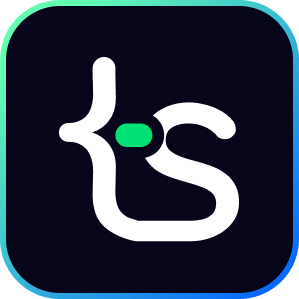

# 01 - Intro: Vibe Coding to Production Ready

## **🎯 Goal of This Lesson**

- Welcome to the "Full Stack Journey:  Vibe Coding to Production Ready" series!
- What's Vibe Coding?
- What's Full Stack Engineering?
- What's Production Ready?.
- Quick roadmap of what’s coming in this series.
- Task and How to Submit

## 🫶 Support

Your support means a lot.

- Please SUBSCRIBE to [tapaScript YouTube Channel](https://youtube.com/tapasadhikary) if not done already. A Big Thank You!
- Liked my work? It takes months of hard work to create quality content and present it to you. You can show your support to me with a STAR(⭐) to this repository.

    > Many Thanks to all the `Stargazers` who have supported this project with stars(⭐)

### 🤝 Sponsor My Work

I am an independent educator and open-source enthusiast who creates meaningful projects to teach programming on my YouTube Channel. **You can support my work by [Sponsoring me on GitHub](https://github.com/sponsors/atapas) or [Buy Me a Cofee](https://buymeacoffee.com/tapasadhikary)**.

## Video

Here is the video for you to go through and learn:

## **👩‍💻 🧑‍💻 Assignment Tasks**

Check out the [Task File](./task.md)
